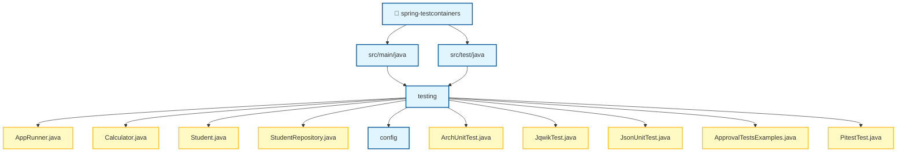

# Spring Boot Testing Demo

Proyecto para probar herramientas utiles.

---

## 🛠️ Herramientas Incluidas

| Herramienta       | Propósito               | Ubicación Config                    |
|-------------------|-------------------------|-------------------------------------|
| **Jacoco**        | Cobertura de código     | `pom.xml` → plugin                  |
| **Pitest**        | Mutation testing        | `pom.xml` → plugin                  |
| **Flyway**        | Migraciones de BD       | `FlywayConfig.java`                 |
| **ArchUnit**      | Tests de arquitectura   | `ArchUnitTest.java`                 |
| **P6Spy**         | Logging SQL             | `src/main/resources/spy.properties` |
| **QueryDSL**      | Queries type-safe       | `StudentQueryRepository.java`       |
| **OpenRewrite**   | Refactoring automático  | `rewrite.yml`                       |
| **Error Prone**   | Análisis estático       | `pom.xml` → compiler plugin         |
| **ApprovalTests** | Snapshot testing        | `ApprovalTestsExamples.java`        |
| **Faker**         | Datos fake para tests   | `pom.xml` → javafaker               |
| **JSON-Unit**     | Comparación JSON        | `JsonUnitExamplesTest.java`         |
| **jqwik**         | Property-based tests    | `JqwikExampleTest.java`             |
| **Testcontainers**| Contenedores para tests | `TestContainersIT.java`             |

---

## 📦 Comandos Principales

```bash
# ═══════════════════════════════════════════════════════════════════
# COMPILAR (genera Q-classes de QueryDSL)
# ═══════════════════════════════════════════════════════════════════
./mvnw clean compile

# ═══════════════════════════════════════════════════════════════════
# TESTS + COBERTURA JACOCO
# Reporte: target/site/jacoco/index.html
# Open: target/site/jacoco/index.html
# ═══════════════════════════════════════════════════════════════════
./mvnw test jacoco:report

# ═══════════════════════════════════════════════════════════════════
# MUTATION TESTING (PITEST)
# Reporte: target/pit-reports/
# Open: target/pit-reports/index.html
# ═══════════════════════════════════════════════════════════════════
./mvnw test-compile org.pitest:pitest-maven:mutationCoverage

# ═══════════════════════════════════════════════════════════════════
# OPENREWRITE
# ═══════════════════════════════════════════════════════════════════
./mvnw rewrite:dryRun    # Ver cambios sin aplicar
./mvnw rewrite:run       # Aplicar refactoring
./mvnw rewrite:discover  # Listar recetas disponibles

# ═══════════════════════════════════════════════════════════════════
# EJECUTAR TESTS ESPECÍFICOS
# ═══════════════════════════════════════════════════════════════════
./mvnw test -Dtest=ArchUnitTest            # ArchUnit
./mvnw test -Dtest=ApprovalTestsExamples   # ApprovalTests
./mvnw test -Dtest=JsonUnitExamplesTest    # JSON-Unit

# ═══════════════════════════════════════════════════════════════════
# INTEGRATION TESTS (FAILSAFE - mvn verify)
# ═══════════════════════════════════════════════════════════════════
./mvnw verify -Dit.test=QueryDslIT        # QueryDSL Integration
./mvnw verify -Dit.test=TestContainersIT   # TestContainers examples
```

---

## 📚 Guía de Uso por Herramienta

### 🔍 Jacoco (Cobertura de Código)

Genera reportes de cobertura de tests.

```bash
./mvnw test jacoco:report
# Abrir: target/site/jacoco/index.html
```

**Configuración (`pom.xml`):**
```xml
<plugin>
    <groupId>org.jacoco</groupId>
    <artifactId>jacoco-maven-plugin</artifactId>
</plugin>
```

---

### 🧬 Pitest (Mutation Testing)

**Concepto**: Herramienta que transforma el código compilado (bytecode) insertando "mutaciones" (bugs artificiales) para verificar si los tests son capaces de detectarlos.
*   **Objetivo**: Obtener una métrica de coverage mucho más realista que la simple cobertura de líneas. Si un mutante sobrevive, significa que el test no es lo suficientemente robusto.
*   **Coste**: Hace que los tests sean mucho más lentos. Usar en situaciones críticas o para aprendizaje.

Introduce mutaciones en el código y verifica que los tests las detecten.

```bash
./mvnw test-compile org.pitest:pitest-maven:mutationCoverage
# Reporte: target/pit-reports/
```

**Ejemplo de mutación:**
```java
// Original
if (balance >= amount) { ... }

// Mutación (cambia >= por >)
if (balance > amount) { ... }  // ¿El test lo detecta?
```

---

### 🗄️ Flyway (Migraciones de BD)

Versiona el esquema de base de datos de forma programática.

**Configuración (`FlywayConfig.java`):**
- Gestiona localizaciones dinámicamente (`db/migrations` y `db/dev` en perfil `dev`).
- Ejecuta `migrate()` automáticamente solo en perfil `dev`.
- Permite comportamiento flexible para H2/Tests mediante `flyway.h2-behavior`.

**Ubicación:** `src/main/resources/db/migrations/`

#### 💡 Conceptos Clave de Flyway

1. **`flyway_schema_history`**: Es la tabla que Flyway crea automáticamente en tu base de datos para llevar el control. Guarda el checksum de cada script, quién lo ejecutó y cuándo. Si intentas modificar un script `V` que ya ha sido aplicado, Flyway lanzará un error de validación.
2. **Convención de Nombres**: Los archivos deben seguir el patrón `<Prefijo><Versión>__<Descripción>.sql`.
   - **IMPORTANTE**: Se usan **dos guiones bajos (`__`)** para separar la versión de la descripción. Sin ellos, Flyway no reconocerá el archivo.
3. **Estrategias de Versión (`V`)**:
   - **Secuencial**: `V1__init.sql`, `V2__add_col.sql`. Ideal para proyectos pequeños o con un solo equipo.
   - **Timestamp**: `V2024_12_28_2300__add_index.sql`. Muy recomendado en entornos con múltiples desarrolladores para evitar conflictos de números de versión al fusionar ramas.
4. **Migraciones Repetibles (`R`)**:
   - No tienen versión fija. Se ejecutan **siempre que su contenido cambie** (el checksum sea distinto).
   - Ejemplo: `R__Load_data.sql`. Ideal para cargar vistas, procedimientos almacenados o datos maestros que necesitas actualizar frecuentemente.
5. **Propiedad Custom `flyway.h2-behavior`**:
   - Es una propiedad casera definida en `FlywayConfig.java`.
   - Si se establece en `true`, Flyway ejecutará un `clean()` al arrancar la aplicación.
   - **Propósito**: Imitar el comportamiento de una base de datos H2 (en memoria), donde cada vez que arrancas la aplicación, la base de datos está vacía y se reconstruye desde cero. Muy útil para desarrollo rápido si quieres garantizar un estado limpio sin recrear contenedores.

**Ejemplo de estructura:**
```sql
-- V1__create_tables.sql (Versionada)
CREATE TABLE student (
    id BIGINT PRIMARY KEY,
    name VARCHAR(255),
    email VARCHAR(255) UNIQUE
);

-- R__Load_data.sql (Repetible)
INSERT INTO student (id, name, email) VALUES (1, 'John', 'john@test.com')
ON CONFLICT (id) DO NOTHING;
```

---

### 🐳 Docker Compose Integration (Spring Boot)

Spring Boot gestiona automáticamente la infraestructura local necesaria para el desarrollo.

**Funcionamiento:**
- Al arrancar la aplicación en local, Spring Boot detecta el archivo `compose.yaml` (o `compose.yml`).
- Levanta automáticamente los servicios definidos (ej. PostgreSQL) utilizando Docker Compose.
- Inyecta dinámicamente las propiedades de conexión (JDBC URL, usuario, password) en el contexto de Spring, eliminando la necesidad de configurarlas manualmente en `application.properties`.

**Archivo de Configuración:** `compose.yaml`

---

### 🧪 jqwik (Property-Based Testing)

Permite validar **invariantes** de negocio generando cientos de entradas aleatorias automáticamente. A diferencia de los tests tradicionales (basados en ejemplos), jqwik busca casos de borde que un humano podría olvidar.

**Uso Recomendado:** Para reglas de negocio complejas, validación de rangos, transformaciones de datos y algoritmos.

**Ejemplo (`JqwikExampleTest.java`):**
```java
@Property
void additionIsCommutative(@ForAll int a, @ForAll int b) {
    assertThat(a + b).isEqualTo(b + a);
}

@Property
void percentageShouldStayInValidRange(
    @ForAll @IntRange(min = 0, max = 100) int percentage
) {
    assertThat(percentage).isBetween(0, 100);
}
```

---

### 🏛️ ArchUnit (Tests de Arquitectura)

Valida reglas de arquitectura en tiempo de test.

**Ejemplo (`ArchUnitTest.java`):**
```java
@Test
void controllersShouldNotAccessRepositoriesDirectly() {
    noClasses()
        .that().haveSimpleNameEndingWith("Controller")
        .should().dependOnClassesThat()
        .haveSimpleNameEndingWith("Repository")
        .check(importedClasses);
}
```

---

### 🔎 P6Spy (SQL Logging)

Intercepta y loguea todas las queries SQL. Habilitado por defecto en los perfiles `dev` y `test`.

**Configuración (`spy.properties`):**
```properties
appender=com.p6spy.engine.spy.appender.Slf4JLogger
# MultiLineFormat permite ver la query original y la query con valores
logMessageFormat=com.p6spy.engine.spy.appender.MultiLineFormat
```

**Output:**
```
P6SPY | took 1ms | statement | connection 10
insert into student (email,gender,name,id) values (?,?,?,?)
insert into student (email,gender,name,id) values ('john@test.com','MALE','John',10);
```

---

### 🔎 QueryDSL (Queries Type-Safe)

Queries compiladas en tiempo de compilación.

**Ejemplo (`StudentQueryRepository.java`):**
```java
public List<Student> searchStudents(String name, Gender gender) {
    QStudent student = QStudent.student;
    
    BooleanExpression predicate = student.isNotNull();
    if (name != null) {
        predicate = predicate.and(student.name.containsIgnoreCase(name));
    }
    if (gender != null) {
        predicate = predicate.and(student.gender.eq(gender));
    }
    
    return queryFactory.selectFrom(student).where(predicate).fetch();
}
```

---

### 🔄 OpenRewrite (Refactoring Automático)

Aplica transformaciones de código automáticamente.

**Configuración (`rewrite.yml`):**
```yaml
type: specs.openrewrite.org/v1beta/recipe
name: com.example.CustomRecipes
recipeList:
  - org.openrewrite.java.format.AutoFormat
```

```bash
./mvnw rewrite:dryRun  # Preview
./mvnw rewrite:run     # Apply
```

---

### ⚠️ Error Prone (Análisis Estático)

Detecta errores comunes en tiempo de compilación.

**Detecta:**
- Null pointer dereferences
- Comparaciones incorrectas
- Uso incorrecto de APIs

---

### ✅ ApprovalTests (Snapshot Testing)

Compara output con archivos baseline aprobados.

**Ejemplo (`ApprovalTestsExamples.java`):**
```java
@Test
void testStudentToString() {
    Student student = new Student("John", "john@test.com", Gender.MALE);
    Approvals.verify(student.toString());
}
```

**Archivos generados:**
- `.approved.txt` - Baseline aprobado
- `.received.txt` - Output actual (si difiere)

---

### 📊 JSON-Unit (Comparación JSON)

Assertions fluidas para JSON.

**Ejemplo (`JsonUnitExamplesTest.java`):**
```java
@Test
void shouldMatchJson() {
    String actual = """{"name": "John", "age": 25}""";
    
    assertThatJson(actual)
        .inPath("$.name").isEqualTo("John")
        .inPath("$.age").isNumber();
}

@Test
void shouldIgnoreFields() {
    assertThatJson(actual)
        .whenIgnoringPaths("$.id", "$.createdAt")
        .isEqualTo(expected);
}
```

---

### 🎭 Faker (Datos Fake)

Genera datos aleatorios para tests.

```java
Faker faker = new Faker();
String name = faker.name().fullName();        // "John Smith"
String email = faker.internet().emailAddress(); // "john@test.com"
String phone = faker.phoneNumber().phoneNumber();
```

---

### 🐳 Testcontainers (Contenedores para Tests)

Levanta infraestructura real (Bases de datos, Redis, etc.) en contenedores Docker para los tests de integración (Gestionado por **Maven Failsafe**).

**Configuración Avanzada:**
- **Reutilización (`.withReuse(true)`):** Permite mantener los contenedores vivos entre ejecuciones de tests, acelerando drásticamente el feedback.
    - Requiere el archivo `%USERPROFILE%/.testcontainers.properties` con `testcontainers.reuse.enable=true`.
- **Integración con Spring Boot:**
    - `@ServiceConnection`: Configura automáticamente las propiedades de conexión (JDBC URL, username, password) basándose en el contenedor.
    - **Uso en Desarrollo:** Puedes usar `@Container` + `@Bean` en una clase de configuración de test para levantar la infraestructura automáticamente al ejecutar la aplicación en modo `dev`.

**Ejemplo (`TestContainersIT.java`):**
```java
@Container
@ServiceConnection
static PostgreSQLContainer<?> postgres = new PostgreSQLContainer<>("postgres:16-alpine")
        .withReuse(true);
```

**Ventajas:**
- Entornos de test idénticos a producción.
- Sin necesidad de instalar bases de datos localmente.
- Soporte para `postgres:16-alpine` para imágenes ligeras.

---


<br>

<div align="center">

## 📂 Estructura del Proyecto


</div>
---

## 🚀 Requisitos

- **Java 21**
- **Docker** (para TestContainers)
- **Maven 3.9+**