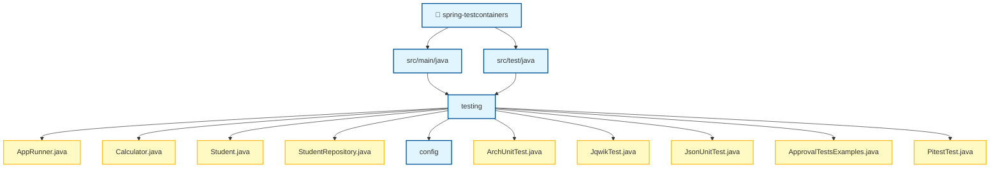

# Spring Boot Testing Demo

Showcase de herramientas útiles para el ecosistema Java.

La documentación se ha dividido en secciones para facilitar su lectura:

## 📂 Documentación

1.  ### 🧪 [Testing Ecosystem](README-test.md)
    Guía completa de herramientas de testing: JUnit 5, Mockito, Cucumber, Selenium, Testcontainers, jqwik, Pitest y más.

2.  ### ☕ [Java & Infrastructure](README-java.md)
    Herramientas de desarrollo y persistencia: Flyway, QueryDSL, P6Spy, Docker Compose y OpenRewrite.

---

## 🚀 Inicio Rápido

Para compilar el proyecto y generar las clases de QueryDSL:
```bash
./mvnw clean compile
```

Para ejecutar la batería completa de tests:
```bash
./mvnw test
./mvnw verify
```

## 📂 Estructura del Proyecto



---

## 📦 Comandos Principales

# ═══════════════════════════════════════════════════════════════════
# TESTS + COBERTURA JACOCO
# Reporte: target/site/jacoco/index.html
# Open: target/site/jacoco/index.html
# ═══════════════════════════════════════════════════════════════════
./mvnw test jacoco:report

# ═══════════════════════════════════════════════════════════════════
# MUTATION TESTING (PITEST)
# Reporte: target/pit-reports/
# Open: target/pit-reports/index.html
# ═══════════════════════════════════════════════════════════════════
./mvnw test-compile org.pitest:pitest-maven:mutationCoverage

# ═══════════════════════════════════════════════════════════════════
# OPENREWRITE
# ═══════════════════════════════════════════════════════════════════
./mvnw rewrite:dryRun    # Ver cambios sin aplicar
./mvnw rewrite:run       # Aplicar refactoring
./mvnw rewrite:discover  # Listar recetas disponibles

## 📦 Ejecutar tests especificos

# ═══════════════════════════════════════════════════════════════════
# UNIT TESTS (SUREFIRE - mvn test)
# ═══════════════════════════════════════════════════════════════════
./mvnw test -Dtest=ArchUnitTest            # ArchUnit
./mvnw test -Dtest=ApprovalTestsExamples   # ApprovalTests
./mvnw test -Dtest=JsonUnitExamplesTest    # JSON-Unit
./mvnw test -Dtest=MockitoShowcaseTest     # Mockito
./mvnw test -Dtest=WireMockShowcaseTest    # WireMock
./mvnw test -Dtest=RestAssuredShowcaseTest # REST Assured
./mvnw test -Dtest=AssertJ                 # AssertJ examples
./mvnw test -Dtest=JUnit5ShowcaseTest      # JUnit 5
./mvnw test -Dtest=ParameterizedShowcaseTest # JUnit 5 Parameterized
./mvnw test -Dtest=FileParameterizedTest    # JUnit 5 File-based
./mvnw test -Dtest=CucumberShowcaseTest
./mvnw test -Dtest=SeleniumShowcaseTest
./mvnw test -Dtest=AwaitilityShowcaseTest

# ═══════════════════════════════════════════════════════════════════
# INTEGRATION TESTS (FAILSAFE - mvn verify)
# ═══════════════════════════════════════════════════════════════════
./mvnw verify -Dit.test=QueryDslIT        # QueryDSL Integration
./mvnw verify -Dit.test=TestContainersIT   # TestContainers examples
```

## 🚀 Requisitos

- **Java 21**
- **Docker** (para TestContainers)
- **Maven 3.9+**