# Spring Boot Testing Demo

Proyecto para probar herramientas utiles.

---

## 🛠️ Herramientas Incluidas

| Herramienta       | Propósito               | Ubicación Config                    |
|-------------------|-------------------------|-------------------------------------|
| **Jacoco**        | Cobertura de código     | `pom.xml` → plugin                  |
| **Pitest**        | Mutation testing        | `pom.xml` → plugin                  |
| **Flyway**        | Migraciones de BD       | `FlywayConfig.java`                 |
| **ArchUnit**      | Tests de arquitectura   | `ArchUnitTest.java`                 |
| **P6Spy**         | Logging SQL             | `src/main/resources/spy.properties` |
| **QueryDSL**      | Queries type-safe       | `StudentQueryRepository.java`       |
| **OpenRewrite**   | Refactoring automático  | `rewrite.yml`                       |
| **Error Prone**   | Análisis estático       | `pom.xml` → compiler plugin         |
| **ApprovalTests** | Snapshot testing        | `ApprovalTestsExamples.java`        |
| **Faker**         | Datos fake para tests   | `pom.xml` → javafaker               |
| **JSON-Unit**     | Comparación JSON        | `JsonUnitExamplesTest.java`         |
| **jqwik**         | Property-based tests    | `JqwikExampleTest.java`             |
| **Testcontainers**| Contenedores para tests | `TestContainersIT.java`             |
| **Mockito**       | Mocks y Stubs           | `MockitoShowcaseTest.java`          |
| **WireMock**      | Mocking de APIs HTTP    | `WireMockShowcaseTest.java`         |
| **REST Assured**   | Testing de APIs HTTP    | `RestAssuredShowcaseTest.java`      |
| **AssertJ**        | Asserts fluidos         | `AssertJ.java`                      |
| **JUnit 5**        | Framework de testing    | `JUnit5ShowcaseTest.java`           |
| **Cucumber**       | BDD (Gherkin)           | `CucumberShowcaseTest.java`          |


---

## 📦 Comandos Principales

```bash
# ═══════════════════════════════════════════════════════════════════
# COMPILAR (genera Q-classes de QueryDSL)
# ═══════════════════════════════════════════════════════════════════
./mvnw clean compile

# ═══════════════════════════════════════════════════════════════════
# TESTS + COBERTURA JACOCO
# Reporte: target/site/jacoco/index.html
# Open: target/site/jacoco/index.html
# ═══════════════════════════════════════════════════════════════════
./mvnw test jacoco:report

# ═══════════════════════════════════════════════════════════════════
# MUTATION TESTING (PITEST)
# Reporte: target/pit-reports/
# Open: target/pit-reports/index.html
# ═══════════════════════════════════════════════════════════════════
./mvnw test-compile org.pitest:pitest-maven:mutationCoverage

# ═══════════════════════════════════════════════════════════════════
# OPENREWRITE
# ═══════════════════════════════════════════════════════════════════
./mvnw rewrite:dryRun    # Ver cambios sin aplicar
./mvnw rewrite:run       # Aplicar refactoring
./mvnw rewrite:discover  # Listar recetas disponibles

# ═══════════════════════════════════════════════════════════════════
# EJECUTAR TESTS ESPECÍFICOS
# ═══════════════════════════════════════════════════════════════════
./mvnw test -Dtest=ArchUnitTest            # ArchUnit
./mvnw test -Dtest=ApprovalTestsExamples   # ApprovalTests
./mvnw test -Dtest=JsonUnitExamplesTest    # JSON-Unit
./mvnw test -Dtest=MockitoShowcaseTest     # Mockito
./mvnw test -Dtest=WireMockShowcaseTest    # WireMock
./mvnw test -Dtest=RestAssuredShowcaseTest # REST Assured
./mvnw test -Dtest=AssertJ                 # AssertJ examples
./mvnw test -Dtest=JUnit5ShowcaseTest      # JUnit 5
./mvnw test -Dtest=ParameterizedShowcaseTest # JUnit 5 Parameterized
./mvnw test -Dtest=FileParameterizedTest    # JUnit 5 File-based
./mvnw test -Dtest=CucumberShowcaseTest     # Cucumber (BDD)

# ═══════════════════════════════════════════════════════════════════
# INTEGRATION TESTS (FAILSAFE - mvn verify)
# ═══════════════════════════════════════════════════════════════════
./mvnw verify -Dit.test=QueryDslIT        # QueryDSL Integration
./mvnw verify -Dit.test=TestContainersIT   # TestContainers examples
```

---

## 📚 Guía de Uso por Herramienta

### 🔍 Jacoco (Cobertura de Código)

Genera reportes de cobertura de tests.

```bash
./mvnw test jacoco:report
# Abrir: target/site/jacoco/index.html
```

**Configuración (`pom.xml`):**
```xml
<plugin>
    <groupId>org.jacoco</groupId>
    <artifactId>jacoco-maven-plugin</artifactId>
</plugin>
```

---

### 🧬 Pitest (Mutation Testing)

**Concepto**: Herramienta que transforma el código compilado (bytecode) insertando "mutaciones" (bugs artificiales) para verificar si los tests son capaces de detectarlos.
*   **Objetivo**: Obtener una métrica de coverage mucho más realista que la simple cobertura de líneas. Si un mutante sobrevive, significa que el test no es lo suficientemente robusto.
*   **Coste**: Hace que los tests sean mucho más lentos. Usar en situaciones críticas o para aprendizaje.

Introduce mutaciones en el código y verifica que los tests las detecten.

```bash
./mvnw test-compile org.pitest:pitest-maven:mutationCoverage
# Reporte: target/pit-reports/
```

**Ejemplo de mutación:**
```java
// Original
if (balance >= amount) { ... }

// Mutación (cambia >= por >)
if (balance > amount) { ... }  // ¿El test lo detecta?
```

---

### 🗄️ Flyway (Migraciones de BD)

Versiona el esquema de base de datos de forma programática.

**Configuración (`FlywayConfig.java`):**
- Gestiona localizaciones dinámicamente (`db/migrations` y `db/dev` en perfil `dev`).
- Ejecuta `migrate()` automáticamente solo en perfil `dev`.
- Permite comportamiento flexible para H2/Tests mediante `flyway.h2-behavior`.

**Ubicación:** `src/main/resources/db/migrations/`

#### 💡 Conceptos Clave de Flyway

1. **`flyway_schema_history`**: Es la tabla que Flyway crea automáticamente en tu base de datos para llevar el control. Guarda el checksum de cada script, quién lo ejecutó y cuándo. Si intentas modificar un script `V` que ya ha sido aplicado, Flyway lanzará un error de validación.
2. **Convención de Nombres**: Los archivos deben seguir el patrón `<Prefijo><Versión>__<Descripción>.sql`.
   - **IMPORTANTE**: Se usan **dos guiones bajos (`__`)** para separar la versión de la descripción. Sin ellos, Flyway no reconocerá el archivo.
3. **Estrategias de Versión (`V`)**:
   - **Secuencial**: `V1__init.sql`, `V2__add_col.sql`. Ideal para proyectos pequeños o con un solo equipo.
   - **Timestamp**: `V2024_12_28_2300__add_index.sql`. Muy recomendado en entornos con múltiples desarrolladores para evitar conflictos de números de versión al fusionar ramas.
4. **Migraciones Repetibles (`R`)**:
   - No tienen versión fija. Se ejecutan **siempre que su contenido cambie** (el checksum sea distinto).
   - Ejemplo: `R__Load_data.sql`. Ideal para cargar vistas, procedimientos almacenados o datos maestros que necesitas actualizar frecuentemente.
5. **Propiedad Custom `flyway.h2-behavior`**:
   - Es una propiedad casera definida en `FlywayConfig.java`.
   - Si se establece en `true`, Flyway ejecutará un `clean()` al arrancar la aplicación.
   - **Propósito**: Imitar el comportamiento de una base de datos H2 (en memoria), donde cada vez que arrancas la aplicación, la base de datos está vacía y se reconstruye desde cero. Muy útil para desarrollo rápido si quieres garantizar un estado limpio sin recrear contenedores.

**Ejemplo de estructura:**
```sql
-- V1__create_tables.sql (Versionada)
CREATE TABLE student (
    id BIGINT PRIMARY KEY,
    name VARCHAR(255),
    email VARCHAR(255) UNIQUE
);

-- R__Load_data.sql (Repetible)
INSERT INTO student (id, name, email) VALUES (1, 'John', 'john@test.com')
ON CONFLICT (id) DO NOTHING;
```

---

### 🐳 Docker Compose Integration (Spring Boot)

Spring Boot gestiona automáticamente la infraestructura local necesaria para el desarrollo.

**Funcionamiento:**
- Al arrancar la aplicación en local, Spring Boot detecta el archivo `compose.yaml` (o `compose.yml`).
- Levanta automáticamente los servicios definidos (ej. PostgreSQL) utilizando Docker Compose.
- Inyecta dinámicamente las propiedades de conexión (JDBC URL, usuario, password) en el contexto de Spring, eliminando la necesidad de configurarlas manualmente en `application.properties`.

**Archivo de Configuración:** `compose.yaml`

---

### 🧪 jqwik (Property-Based Testing)

Permite validar **invariantes** de negocio generando cientos de entradas aleatorias automáticamente. A diferencia de los tests tradicionales (basados en ejemplos), jqwik busca casos de borde que un humano podría olvidar.

**Uso Recomendado:** Para reglas de negocio complejas, validación de rangos, transformaciones de datos y algoritmos.

**Ejemplo (`JqwikExampleTest.java`):**
```java
@Property
void additionIsCommutative(@ForAll int a, @ForAll int b) {
    assertThat(a + b).isEqualTo(b + a);
}

@Property
void percentageShouldStayInValidRange(
    @ForAll @IntRange(min = 0, max = 100) int percentage
) {
    assertThat(percentage).isBetween(0, 100);
}
```

---

### 🏛️ ArchUnit (Tests de Arquitectura)

Valida reglas de arquitectura en tiempo de test.

**Ejemplo (`ArchUnitTest.java`):**
```java
@Test
void controllersShouldNotAccessRepositoriesDirectly() {
    noClasses()
        .that().haveSimpleNameEndingWith("Controller")
        .should().dependOnClassesThat()
        .haveSimpleNameEndingWith("Repository")
        .check(importedClasses);
}
```

---

### 🔎 P6Spy (SQL Logging)

Intercepta y loguea todas las queries SQL. Habilitado por defecto en los perfiles `dev` y `test`.

**Configuración (`spy.properties`):**
```properties
appender=com.p6spy.engine.spy.appender.Slf4JLogger
# MultiLineFormat permite ver la query original y la query con valores
logMessageFormat=com.p6spy.engine.spy.appender.MultiLineFormat
```

**Output:**
```
P6SPY | took 1ms | statement | connection 10
insert into student (email,gender,name,id) values (?,?,?,?)
insert into student (email,gender,name,id) values ('john@test.com','MALE','John',10);
```

---

### 🔎 QueryDSL (Queries Type-Safe)

Queries compiladas en tiempo de compilación.

**Ejemplo (`StudentQueryRepository.java`):**
```java
public List<Student> searchStudents(String name, Gender gender) {
    QStudent student = QStudent.student;
    
    BooleanExpression predicate = student.isNotNull();
    if (name != null) {
        predicate = predicate.and(student.name.containsIgnoreCase(name));
    }
    if (gender != null) {
        predicate = predicate.and(student.gender.eq(gender));
    }
    
    return queryFactory.selectFrom(student).where(predicate).fetch();
}
```

---

### 🔄 OpenRewrite (Refactoring Automático)

Aplica transformaciones de código automáticamente.

**Configuración (`rewrite.yml`):**
```yaml
type: specs.openrewrite.org/v1beta/recipe
name: com.example.CustomRecipes
recipeList:
  - org.openrewrite.java.format.AutoFormat
```

```bash
./mvnw rewrite:dryRun  # Preview
./mvnw rewrite:run     # Apply
```

---

### ⚠️ Error Prone (Análisis Estático)

Detecta errores comunes en tiempo de compilación.

**Detecta:**
- Null pointer dereferences
- Comparaciones incorrectas
- Uso incorrecto de APIs

---

### ✅ ApprovalTests (Snapshot Testing)

Compara output con archivos baseline aprobados.

**Ejemplo (`ApprovalTestsExamples.java`):**
```java
@Test
void testStudentToString() {
    Student student = new Student("John", "john@test.com", Gender.MALE);
    Approvals.verify(student.toString());
}
```

**Archivos generados:**
- `.approved.txt` - Baseline aprobado
- `.received.txt` - Output actual (si difiere)

---

### 📊 JSON-Unit (Comparación JSON)

Assertions fluidas para JSON.

**Ejemplo (`JsonUnitExamplesTest.java`):**
```java
@Test
void shouldMatchJson() {
    String actual = """{"name": "John", "age": 25}""";
    
    assertThatJson(actual)
        .inPath("$.name").isEqualTo("John")
        .inPath("$.age").isNumber();
}

@Test
void shouldIgnoreFields() {
    assertThatJson(actual)
        .whenIgnoringPaths("$.id", "$.createdAt")
        .isEqualTo(expected);
}
```

---

### 🎭 Faker (Datos Fake)

Genera datos aleatorios para tests.

```java
Faker faker = new Faker();
String name = faker.name().fullName();        // "John Smith"
String email = faker.internet().emailAddress(); // "john@test.com"
String phone = faker.phoneNumber().phoneNumber();
```

---

### 🐳 Testcontainers (Contenedores para Tests)

Levanta infraestructura real (Bases de datos, Redis, etc.) en contenedores Docker para los tests de integración (Gestionado por **Maven Failsafe**).

**Configuración Avanzada:**
- **Reutilización (`.withReuse(true)`):** Permite mantener los contenedores vivos entre ejecuciones de tests, acelerando drásticamente el feedback.
    - Requiere el archivo `%USERPROFILE%/.testcontainers.properties` con `testcontainers.reuse.enable=true`.
- **Integración con Spring Boot:**
    - `@ServiceConnection`: Configura automáticamente las propiedades de conexión (JDBC URL, username, password) basándose en el contenedor.
    - **Uso en Desarrollo:** Puedes usar `@Container` + `@Bean` en una clase de configuración de test para levantar la infraestructura automáticamente al ejecutar la aplicación en modo `dev`.

**Ejemplo (`TestContainersIT.java`):**
```java
@Container
@ServiceConnection
static PostgreSQLContainer<?> postgres = new PostgreSQLContainer<>("postgres:16-alpine")
        .withReuse(true);
```

**Ventajas:**
- Entornos de test idénticos a producción.
- Sin necesidad de instalar bases de datos localmente.
- Soporte para `postgres:16-alpine` para imágenes ligeras.

---


---

### 🎭 Mockito (Mocks y Stubs)

Herramienta esencial para aislar el código bajo test mediante la creación de objetos simulados (mocks). Fundamental para tests unitarios sociales donde queremos controlar el comportamiento de los colaboradores.

**Uso Principal**: Dobles de test (Mocks, Stubs, Spies) y verificaciones de comportamiento.

```bash
./mvnw test -Dtest=MockitoShowcaseTest
```

#### 💡 Conceptos Clave de Mockito

1.  **Stubbing (`when...thenReturn`)**: Define qué debe devolver un método del mock cuando se llama con ciertos parámetros.
2.  **Dynamic Stubs (`thenAnswer`)**: Permite lógica dinámica basada en los argumentos recibidos. Muy útil para simular cálculos o comportamientos complejos.
3.  **Sequential Stubbing**: Permite definir diferentes respuestas para llamadas sucesivas al mismo método (útil para simular **retries** o cambios de estado).
4.  **Verification (`verify`)**: Comprueba que un método ha sido llamado con los parámetros esperados, cuántas veces (`times`, `never`), o incluso el orden (`InOrder`).
5.  **Argument Matchers (`any()`, `eq()`, `argThat()`)**: Permiten hacer stubs o verificaciones flexibles sin necesidad de conocer el valor exacto del parámetro.
6.  **Argument Captor (`ArgumentCaptor`)**: Captura los argumentos pasados a un mock para realizar aserciones detalladas sobre ellos a posteriori.
7.  **Spies (`spy`)**: Mocks parciales que envuelven un objeto real. Ejecutan el código real a menos que se haga un stub específico.
8.  **BDDMockito (`given...willReturn`)**: Estilo sintáctico alineado con BDD (Behavior Driven Development) para mejorar la legibilidad.
9.  **Static Mocking (`mockStatic`)**: Permite mockear métodos estáticos. **Es obligatorio** usar `try-with-resources` para asegurar que el mock se cierra y no afecta a otros tests.

**Ejemplo de Verificación y Captura:**
```java
// Capturar un argumento para inspeccionarlo
verify(service).performAction(stringCaptor.capture());
assertThat(stringCaptor.getValue()).contains("Success");

// Stubbing secuencial (Simular fallo y luego éxito)
when(service.call())
    .thenThrow(new RuntimeException())
    .thenReturn("Success!");
```

---

```

---

### 🌐 WireMock (Mocking de APIs HTTP)

Permite simular servicios HTTP externos (APIs de terceros, microservicios) para realizar tests de integración o tests unitarios sociales sin depender de la red o de la disponibilidad de esos servicios.

**Uso Principal**: Mockear dependencias HTTP externas.

```bash
./mvnw test -Dtest=WireMockShowcaseTest
```

#### 💡 Conceptos Clave de WireMock

1.  **Stubbing (`stubFor`)**: Define qué responder ante una petición HTTP específica.
2.  **Request Matching**: Filtrado potente de peticiones por URL, headers, cookies y cuerpo (JSON, XML, regex).
3.  **Fault Injection**: Simula fallos de red (conexiones cerradas, respuestas lentas, datos corruptos) para probar la resiliencia de la APP.
4.  **Response Templating**: Genera respuestas basadas en los datos de la petición (ej. devolver el mismo ID enviado).

---

### 🧪 REST Assured (Testing de APIs HTTP)

Biblioteca para testar APIs REST de forma fluida y legible, inspirada en BDD (Given/When/Then). Se integra perfectamente con Hamcrest para validaciones potentes.

**Uso Principal**: Validar endpoints de nuestra APP o de mocks (como WireMock).

```bash
./mvnw test -Dtest=RestAssuredShowcaseTest
```

#### 💡 Conceptos Clave de REST Assured

1.  **Sintaxis Gherkin (`given().when().then()`)**: Estructura de test muy legible y semántica.
2.  **Validación de JSON Path**: Permite navegar por estructuras JSON complejas y aplicar matchers.
3.  **Configuración de Base Path/Port**: Facilita el testeo contra diferentes entornos o servidores dinámicos (como Testcontainers o WireMock).

**Ejemplo Combinado (WireMock + REST Assured):**
```java
// Mockear endpoint con WireMock
stubFor(get("/api/user/1").willReturn(okJson("{\"name\":\"Antigravity\"}")));

// Testear con REST Assured
given()
    .port(wiremockPort)
.when()
    .get("/api/user/1")
.then()
    .statusCode(200)
    .body("name", is("Antigravity"));
```

---

---

### 💖 AssertJ (Assertions Fluidas)

Biblioteca de aserciones que permite escribir tests mucho más legibles y fáciles de mantener gracias a su API fluida. Supera ampliamente a las aserciones básicas de JUnit.

**Uso Principal**: Aserciones ricas y legibles en cualquier tipo de test.

```bash
./mvnw test -Dtest=AssertJ
```

#### 💡 Conceptos Clave de AssertJ

1.  **Colecciones**: Aserciones potentes sobre contenido, orden y tamaño sin necesidad de bucles.
    ```java
    assertThat(list).hasSize(3).contains("A", "B").doesNotContain("C");
    assertThat(list).containsExactlyInAnyOrder("B", "A", "C");
    ```
2.  **Mapping y Extracting**: Permite navegar por los atributos de una colección de objetos de forma sencilla.
    ```java
    assertThat(fellowship)
        .extracting(Character::getName, Character::getAge)
        .contains(tuple("Frodo", 33), tuple("Gandalf", 2000));
    ```
3.  **Fechas y Tiempo**: Aserciones amigables para tipos de `java.time`.
    ```java
    assertThat(lastLogin).isCloseTo(now(), byLessThan(1, SECONDS));
    ```
4.  **Soft Assertions**: Permiten ejecutar múltiples aserciones y ver todos los fallos al final, en lugar de detenerse en el primero.
    ```java
    try (var softly = new AutoCloseableSoftAssertions()) {
        softly.assertThat(user.getName()).isEqualTo("John");
        softly.assertThat(user.getAge()).isEqualTo(25);
    } // Lanza todos los fallos aquí
    ```
5.  **Custom Assertions**: Posibilidad de crear tus propias clases de aserción para tu dominio (ej. `VillaAssert`) para ganar expresividad.

---

---

### 🃏 JUnit 5 (Framework de Testing)

El estándar para testing en Java. Proporciona anotaciones para el ciclo de vida, agrupamiento de tests y un potente motor para tests parametrizados.

**Uso Principal**: Orquestación y estructura de los tests.

```bash
./mvnw test -Dtest=JUnit5ShowcaseTest
```

#### 💡 Conceptos Clave de JUnit 5

1.  **Ciclo de Vida**: `@BeforeEach`, `@AfterEach`, `@BeforeAll`, `@AfterAll`.
2.  **Organización**: `@Nested` para jerarquías, `@Tag` para filtrado, `@DisplayName` para legibilidad.
3.  **Tests Parametrizados (`@ParameterizedTest`)**:
    - **Básicos**: `@ValueSource`, `@CsvSource`, `@EnumSource`.
    - **Objetos**: `@MethodSource` para inyectar POJOs complejos.
    - **Ficheros**: Carga dinámica mediante escaneo de recursos. **Cada caso de prueba es un par de ficheros** (`.in.json` y `.out.json`), facilitando la organización de payloads grandes y la detección de regresiones.

> [!NOTE]
> En el ejemplo de carga por ficheros, JUnit no lee un único JSON con una lista. En su lugar, el `MethodSource` escanea el classpath y genera una iteración por cada pareja de ficheros encontrada.

**Ejemplo de Test Parametrizado desde Fichero:**
```java
@ParameterizedTest(name = "{0}")
@MethodSource("testData")
void fileTest(FileTestCase testCase) {
    var actual = service.execute(testCase.getInput());
    assertThatJson(actual).isEqualTo(testCase.getExpectedOutput());
}
```

---

---

### 🥒 Cucumber (BDD - Behavior Driven Development)

Permite definir el comportamiento del sistema en lenguaje natural (Gherkin), facilitando la comunicación entre perfiles técnicos y de negocio.

**Uso Principal**: Acceptance tests y especificación ejecutable.

```bash
./mvnw test -Dtest=CucumberShowcaseTest
```

#### 💡 Key Concepts of Cucumber

1.  **Gherkin**: A structured language (Given/When/Then) for defining scenarios.
2.  **Feature Files**: `.feature` files containing the specifications.
3.  **Step Definitions**: Java classes mapping Gherkin lines to executable code.
4.  **Cucumber + Spring**: Integration with the Spring context to inject beans into steps.

**Example Scenario (Gherkin):**
```gherkin
Scenario: Transform a simple message
  Given I have a transformer service
  When I transform the message "hello cucumber"
  Then the result should be "HELLO CUCUMBER"
```

---

<br>

<div align="center">

## 📂 Estructura del Proyecto

```mermaid
graph TD
    classDef dir fill:#e1f5fe,stroke:#01579b,stroke-width:2px;
    classDef file fill:#fff9c4,stroke:#fbc02d,stroke-width:2px;
    
    root[🌿 spring-testcontainers]:::dir
    srcMain[src/main/java]:::dir
    srcTest[src/test/java]:::dir
    
    %% Main Packages
    testingPkg[testing]:::dir
    configPkg[config]:::dir
    
    %% Files in Main
    AppRunner[AppRunner.java]:::file
    Calculator[Calculator.java]:::file
    Student[Student.java]:::file
    StudentRepo[StudentRepository.java]:::file
    
    %% Files in Test
    ArchTest[ArchUnitTest.java]:::file
    JqwikTe[JqwikTest.java]:::file
    JsonTest[JsonUnitTest.java]:::file
    Approval[ApprovalTestsExamples.java]:::file
    PitestT[PitestTest.java]:::file
    
    root --> srcMain
    root --> srcTest
    srcMain --> testingPkg
    srcTest --> testingPkg
    
    testingPkg --> AppRunner
    testingPkg --> Calculator
    testingPkg --> Student
    testingPkg --> StudentRepo
    
    testingPkg --> configPkg
    
    testingPkg --> ArchTest
    testingPkg --> JqwikTe
    testingPkg --> JsonTest
    testingPkg --> Approval
    testingPkg --> PitestT
```


</div>
---

## 🚀 Requisitos

- **Java 21**
- **Docker** (para TestContainers)
- **Maven 3.9+**